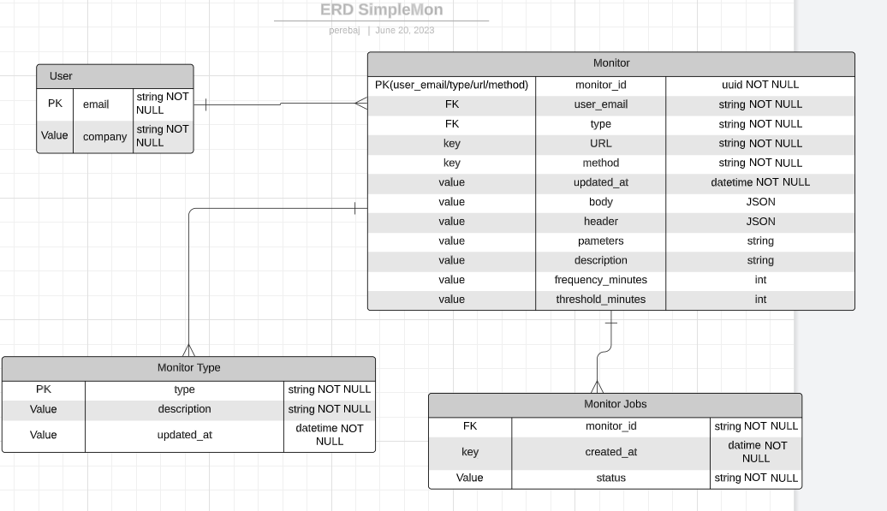

  <h1 style="font-family: 'Playfair Display', serif; font-size: 36px;">SimpleMon</h1>
  
Simplify Your Life with Centralized API Health Monitoring

Are you tired of managing multiple API health checks across different platforms? SimpleMon is here to make your life easier! Our monitoring app provides a centralized place for all your API health needs, allowing you to easily monitor and manage them from one place.
With SimpleMon, you can set up custom alerts and notifications for any issues that arise, ensuring that you are always on top of your API's performance. Say goodbye to the stress of manually checking each API's health status and hello to a simplified monitoring experience.

  

# Get started

To make easy start this project, all commands will be simplified into the `Makefile`, just type `make help` to be aware of all existent commands

But the most useful for a development environment are:

`make dev/start` Up all containers that this application needs

Have you changed some parts of the code and want to **rerun the application?** Just type `make dev/restart`, the API container will be restarted and our changes will be shipped!

How to see the logs that are running into the container?
Simple like type: `make dev/logs`

Finish the day? `make dev/stop`

## Database Migrations

`make migration/up` To populate the Postgres database with the tables
&
`make migration/down` To remove all migrations

# Events and Integrations

# Important Resources

# Database Model

