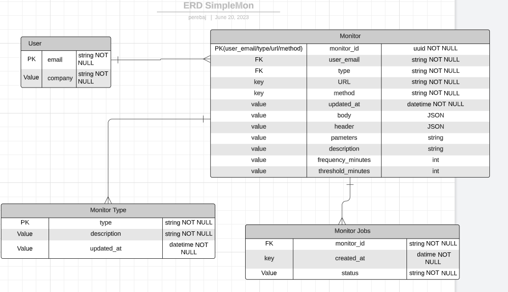

# Simplemon
🌑

# Briefing 

# Get started

To make easy start this project, all commands will be simplified into the `Makefile`, just type `make help` to be aware of all existent commands

# Events and Integrations

# Important Resources

# Database Model

